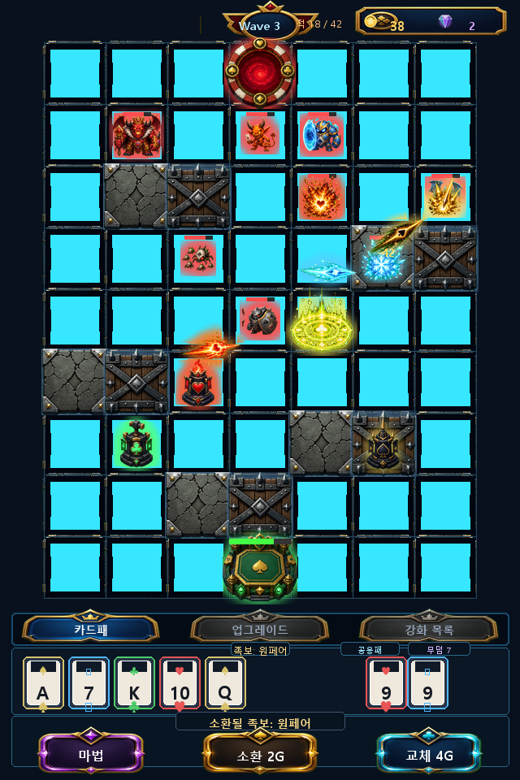

# PokerStrike 湲고쉷??

## 2026-06-18 업데이트: 보드 타일 코드드로잉 1차 정리

- 버전: `v0.1.49`
- 보드 PNG 타일이 로드된 경우 빈 칸 위에 어두운 사각 코드 오버레이를 다시 덮지 않도록 수정했다.
- PNG 보드 타일의 질감과 색을 더 잘 살리기 위해 타일 알파를 높이고, 이미지 타일이 있을 때 격자선 알파를 낮췄다.
- 이미지 리소스가 없을 때는 기존 어두운 사각 폴백을 유지해 개발/테스트 환경에서도 보드가 깨지지 않게 했다.
- 다음 단계 후보: 카드 프레임, 타워 등급 장식, 적 상태 VFX 중 화면 노출이 큰 코드 도형부터 atlas 기반으로 교체한다.

---

## 보드/본진/버튼 PNG 리소스 적용

- 보드 타일, 장애물, 적 스폰 포털, 본진 코어를 PNG 리소스로 생성하고 인게임 렌더링에 적용했다.
- 이동 가능한 빈 칸은 어두운 반투명 오버레이를 적용해 장애물/본진/스폰과 더 명확하게 구분한다.
- 이동 가능한 빈 칸의 타일 알파와 어두운 오버레이 강도를 높여 실제 플레이 화면에서도 어두운 영역 구분이 더 선명하게 보이도록 했다.
- 지을 수 있는 빈 칸의 청록색 내부 글로우와 코너 반짝임은 제거해 보드와 타워/적을 더 잘 읽을 수 있게 했다.
- 장애물은 석재 블록과 목재/철제 바리케이드 두 종류를 교차 사용해 막힌 칸을 더 명확하게 구분한다.
- 본진은 텍스트 라벨 대신 `base-core.png`를 우선 표시해 보드 안에서 시각적으로 더 잘 읽히게 했다.
- 하단 마법/소환/교체 버튼, 탭 버튼, 강화 버튼은 새 PNG 프레임을 사용하고 텍스트는 Phaser에서 별도로 렌더링한다.
- 이미지 버튼 hover는 크기 확대 대신 밝기/투명도 변화만 사용해 한 번 커진 버튼이 원래 크기로 돌아오지 않는 현상을 방지한다.
- 웨이브 강화 선택지는 기존 사각형 박스 대신 UI 키트의 PNG 프레임을 활용한 3지선다 카드형 화면으로 표시한다.
- 하단 마법/소환/교체 버튼은 앞 심볼 없이 텍스트만 표시하고, 버튼 프레임의 시각 중심에 맞도록 라벨 세로 위치를 보정했다.
- `카드패`, `업그레이드`, `강화 목록` 탭 텍스트는 PNG 탭 프레임의 시각 중심에 맞도록 세로 위치를 보정했다.
- 자원 패널과 웨이브 배지도 새 UI 프레임을 preload하며, 리소스가 없을 때는 기존 도형 UI로 폴백한다.
- 전투 메시지 전용 하단 슬롯은 제거하고, 상단 HUD/보드/하단 HUD 사이에 얕은 여백을 확보했다.
- 상단 HUD는 웨이브 정보를 화면 중앙에 두고, 골드/보석 자원은 우측 상단 패널 안에서 아이콘+숫자 묶음으로 우측 정렬한다.
- 웨이브 표기는 `Wave N` 영문 라벨로 배지 이미지의 시각 중심에 맞춰 배치한다.
- 골드와 보석은 텍스트 라벨 대신 전용 PNG 아이콘과 우측 정렬 숫자로 표시한다.
- 현재 구현 플레이 예시 이미지를 새 보드/장애물/본진/버튼 리소스 기준으로 다시 생성했다.

## 타워 시인성과 적 밸런스 조정

- 타워 PNG는 문양과 역할 실루엣이 더 크게 보이는 단순형 디자인으로 교체했다.
- 좋은 족보일수록 타워 크기, 링, 광원, 등급 라벨, 족보별 장식 레이어가 단계적으로 강화되어 낮은 족보와 차이가 크게 느껴지도록 했다.
- 타워 본체와 등급 링은 타일 안쪽 여백을 침범하지 않도록 축소해 전장 시야를 가리지 않게 했다. 투페어와 트리플처럼 인접한 족보도 서로 다른 장식 실루엣을 가진다.
- 타워 HP 바는 피해를 받은 상태에서만 표시하고, 최대 체력일 때는 숨겨 전장 시야를 더 깔끔하게 유지한다.
- 적 기본 이동속도는 전 타입 30% 감소시켰다.
- 전체 적 수량 배율은 기존의 2배로 늘려, 느려진 적이 더 큰 무리로 압박하도록 조정했다.

---

## ?뚮젅??誘몃━蹂닿린

### ?뚮젅??誘몃━蹂닿린

---
## 媛쒖슂

PokerStrike???ъ빱 議깅낫濡??좊떅 ?뚰솚怨?留덈쾿??寃곗젙?섎뒗 ?몃줈??移대뱶 ?뷀렂??寃뚯엫?대떎. ?뚮젅?댁뼱???먰뙣 5?κ낵 怨듭슜??2?μ쓣 ?쎄퀬, ?뚰솚/援먯껜/留덈쾿 以??섎굹瑜??좏깮???⑥씠釉뚮? 諛⑹뼱?쒕떎.

## ?꾩옱 UI 蹂€寃??ы빆

- 移대뱶????쓽 ?먰뙣 ??蹂댁“ ?쇰꺼???쒓굅?덈떎.
- 怨듭슜???쇰꺼 ?놁뿉 `臾대뜡 N` 移댁슫?몃? ?쒖떆?쒕떎.
- 留덈쾿 ?ъ슜 ???먰뙣?€ 怨듭슜?⑥뿉???뚮え??移대뱶???쇰컲 踰꾨┝?⑥? 遺꾨━??留덈쾿 臾대뜡???꾩쟻?쒕떎.
- `移대뱶??, `?낃렇?덉씠??, `媛뺥솕 紐⑸줉` ??쓣 ???볦? ??諛??뺥깭濡??쒖떆???꾩옱 ?좏깮???⑤꼸??紐낇솗??援щ텇?쒕떎.
- ?낃렇?덉씠????쓽 媛뺥솕 踰꾪듉?€ 諛뺤뒪??踰꾪듉?쇰줈 ?뺣━?섍퀬 hover ?곹깭瑜??쒓났?쒕떎.
- 泥??ㅽ뀒?댁? ?대━??吏곹썑 ?낃렇?덉씠???쒗넗由ъ뼹??1???쒖떆?쒕떎.
- ?덉떆 ?대?吏€??HUD??援ъ꽦??李멸퀬???곷떒 ?먯썝 ?쒖떆瑜?諛뺤뒪?뺤쑝濡??뺣━?덈떎.
- 怨⑤뱶?€ 蹂댁꽍?€ ?섎굹???먯썝 ?대윭?ㅽ꽣 ?덉뿉 紐⑥븘 ?쒖떆?쒕떎.
- 泥대젰?€ ?곷떒 HUD?먯꽌 ?쒓굅?섍퀬 蹂몄쭊 移몄쓽 HP 諛붾줈留??쒖떆?쒕떎.
- ?⑥씠釉?UI???먯썝 ?대윭?ㅽ꽣?€ ?⑥뼱吏?蹂꾨룄 諛곗?濡??쒖떆?쒕떎.
- ?섎떒 ?⑤꼸?€ ??諛? 移대뱶, 誘몃━蹂닿린/?≪뀡 踰꾪듉???쒕줈 寃뱀튂吏€ ?딅룄濡?怨좎젙 援ы쉷?쇰줈 ?щ같移섑뻽??
- 怨듭슜??臾대뜡 ?쇰꺼怨?議깅낫 誘몃━蹂닿린??移대뱶 ?꾩뿉 寃뱀퀜 ?꾩슦吏€ ?딄퀬 ?꾩슜 ?쇰꺼 以꾩뿉 ?쒖떆?쒕떎.
- `移대뱶??, `?낃렇?덉씠??, `媛뺥솕 紐⑸줉` ??? 移대뱶 ?꾩そ??諛곗튂?쒕떎.
- 移대뱶 UI???띿꽦???뚮몢由? 諛앹? 移대뱶 硫? ???レ옄 以묒떖?쇰줈 媛€?낆꽦???믪???
- ?띿꽦 ?쒓린???쒓? ?띿꽦紐??€??`??, `??, `??, `?? 移대뱶 臾몄뼇 ?꾩씠肄섎쭔 ?ъ슜?쒕떎.
- 移대뱶 以묒븰 ?レ옄?€ ?섎떒 ?띿꽦 ?꾩씠肄섏쓣 ???ш쾶 ?쒖떆?쒕떎.
- ?뚰솚??議깅낫 誘몃━蹂닿린??????湲€瑗대줈 ?쒖떆?쒕떎.
- ?붾㈃???몄텧?섎뒗 源⑥쭊 ?쒓? 臾몄옄?댁쓣 ?뺤긽 ?쒓뎅?대줈 ?뺣━?덈떎.
- ?꾩옣 ?꾩뿉 吏곸젒 寃뱀튂???곹깭 湲€?먮뒗 ?꾩옣 ?섎떒 硫붿떆吏€ ?щ’怨?怨좎젙 ?뺣낫 ?⑤꼸???쒖떆?쒕떎.
- ???뺣낫 ?⑤꼸?€ ?곸쓣 ?곕씪?ㅻ땲吏€ ?딄퀬 ?곗륫 ?곷떒 怨좎젙 援ъ뿭???쒖떆?쒕떎.
- 洹몃━???€ ?ш린瑜??뚰룺 以꾩뿬 ?꾩옣怨??섎떒 UI ?ъ씠???띿뒪???꾩슜 ?덉쟾 援ъ뿭???뺣낫?쒕떎.
- ???좊떅?€ ?⑥깋 ?꾪삎 ?€???€?낅퀎 ?됱긽怨??μ떇???덈뒗 紐ъ뒪??洹몃옒?쎌쑝濡??쒖떆?쒕떎.
- 踰꾪듉, HUD, 紐⑤떖, ?? 移대뱶 ?μ떇???곸슜??UI 由ъ냼???쒗듃?€ ?곸슜 紐⑸줉??蹂꾨룄 臾몄꽌濡?愿€由ы븳??

## 移대뱶 ?먮쫫

- ?뚰솚: ?먰뙣 5?μ쓣 踰꾨┝?⑤줈 蹂대궡怨????먰뙣瑜?戮묐뒗??
- 援먯껜: ?좏깮???먰뙣 1?μ쓣 踰꾨┝?⑤줈 蹂대궡怨???移대뱶 1?μ쓣 戮묐뒗??
- 留덈쾿: ?먰뙣 5?κ낵 怨듭슜??2?μ쓣 留덈쾿 臾대뜡?쇰줈 蹂대궡怨? ???먰뙣?€ ??怨듭슜?⑤? 戮묐뒗??
- ?뚰솚 珥덇린 鍮꾩슜?€ 2G濡???떠 珥덈컲 ?€???꾧컻 ?띾룄瑜?鍮좊Ⅴ寃??쒕떎.
- ?먰럹??留덈쾿?€ `援먯껜 鍮꾩슜 珥덇린??濡? ?꾩쟻??援먯껜 鍮꾩슜??珥덇린媛믪쑝濡??섎룎由곕떎.

## 臾대뜡 移댁슫??
臾대뜡 移댁슫?몃뒗 留덈쾿?쇰줈 ?뚮え?섏뼱 ?대쾲 ?몄뀡?????쒗솚?먯꽌 鍮좎쭊 移대뱶 ?섎? ?삵븳?? ?쇰컲 ?뚰솚/援먯껜濡?踰꾨┛ 移대뱶????移댁슫?몄뿉 ?ы븿?섏? ?딅뒗??

## ?⑥씠釉?媛뺥솕 ?좏깮吏€

- ?꾩옱 ?€???좊떅??1紐??댁긽???좊떅 媛뺥솕留??좏깮吏€???깆옣?쒕떎.
- ?덈? ?ㅼ뼱 臾??띿꽦 ?좊떅???놁쑝硫?臾??띿꽦 怨듦꺽??媛먯냽/?ш굅由?媛뺥솕???꾨낫?먯꽌 ?쒖쇅?쒕떎.
- ?쒕줈??鍮꾩슜 媛먯냼泥섎읆 ?꾩옱 ?좊떅??吏곸젒 ?€?곸쑝濡??쇱? ?딅뒗 寃쎌젣??媛뺥솕??怨꾩냽 ?깆옣?????덈떎.
- 媛뺥솕 ?좏깮吏€媛€ ?쒖떆?섎뒗 ?숈븞 ?쒓컙 寃쎄낵 怨⑤뱶 ?섏엯?€ ?쇱떆 ?뺤??쒕떎.
- 媛뺥솕 ?좏깮吏€???쒕ぉ/?④낵 湲€瑗댁? ?꾪닾 以묒뿉???쎄린 ?쎈룄濡??ш쾶 ?쒖떆?쒕떎.

## ?낃렇?덉씠??援ъ“

- `?? 蹂댁꽍 媛뺥솕??紐⑤뱺 ?€?뚯뿉 ?곸슜?섎뒗 ?곴뎄 HP/ATK ?깆옣?대떎.
- 怨⑤뱶 臾몄뼇 媛뺥솕??`??, `??, `??, `?? 以??좏깮??臾몄뼇 ?€?뚯쓽 怨듦꺽?λ쭔 10% ?щ┛??
- 怨⑤뱶 臾몄뼇 媛뺥솕??45G濡?鍮꾩슜 ?€鍮??⑥쑉?€ ???留??먰븯??臾몄뼇??蹂닿컯?섎뒗 ?좏깮吏€??
- ?좊떅??吏곸젒 ?좏깮?섎㈃ 湲곗〈泥섎읆 媛쒕퀎 HP/ATK 媛뺥솕???ъ슜?????덈떎.

## ?꾪닾 諛몃윴??蹂€寃?
- ?ㅽ듃?덉씠???뚮윭???ㅻ씪 ?좊떅?€ 二쇰? ?꾧뎔 以?媛숈? ?띿꽦 ?좊떅留?怨듦꺽 ?띾룄瑜?媛뺥솕?쒕떎.
- ?ㅻ씪濡?媛뺥솕 以묒씤 ?좊떅 ?꾩뿉??`媛뺥솕` ?곹깭 ?쒖떆媛€ ?щ떎.
- 諛붾엺 ?띿꽦 ?⑥씪 怨듦꺽?€ ???댁긽 諛⑹뼱?μ쓣 愿€?듯븯吏€ ?딄퀬, 諛⑹뼱??紐ъ뒪?곗쓽 諛⑹뼱?μ뿉 ?곕씪 ?쇳빐媛€ 媛먯냼?쒕떎.
- ???띿꽦 ?좊떅?€ 怨듦꺽 ???€?곸뿉寃?諛⑹뼱??媛먯냼 ?④낵瑜??곸슜?쒕떎. ?깃툒???믪쓣?섎줉 諛⑹뼱??媛먯냼?됱씠 而ㅼ쭊??
- 紐⑤뱺 ?대룞?띾룄 媛먯냼 ?④낵??吏€?띿떆媛꾩씠 ?앸굹硫??곸쓽 ?먮옒 ?대룞?띾룄濡?蹂듦뎄?쒕떎.
- ???좊떅???대┃?섎㈃ ?대떦 ?곸쓽 HP?€ ?꾩옱 諛⑹뼱?μ쓣 ?뺤씤?????덈떎.
- 諛⑹뼱??媛먯냼 ?곹깭???섏튂 ?놁씠 `諛⑹뼱??媛먯냼 以??쇰줈留??쒖떆?쒕떎.
- 寃쎈줈媛€ ?꾩쟾??留됲엺 ?곸? 留됲엺 ?€???듦낵?섏? ?딄퀬, 留됯퀬 ?덈뒗 ?€???€ 諛뽰뿉??硫덉떠 怨듦꺽?쒕떎.

## ?ㅽ뀒?댁? 援ъ꽦

- 紐⑤뱺 ?ㅽ뀒?댁???留덉?留??⑥씠釉뚯뿉??蹂댁뒪 紐ъ뒪?곌? 理쒖냼 1???댁긽 ?깆옣?쒕떎.
- ?ㅼ젣 ?ㅽ룿?섎뒗 ???섎웾?€ 1?ㅽ뀒?댁? 3諛곕? 湲곗??쇰줈, ?ㅽ뀒?댁?媛€ ?ㅻ??섎줉 吏€??諛곗쑉濡?利앷??쒕떎.
- ?ㅽ뀒?댁?蹂????섎웾 諛곗쑉?€ `3 * 1.35^(?ㅽ뀒?댁?-1)`??諛섏삱由쇳빐 ?곸슜?쒕떎.
- 媛??ㅽ뀒?댁???1?⑥씠釉뚮뒗 ?ㅽ뀒?댁? 諛곗쑉??55%留??곸슜???쎄쾶 ?쒖옉?섍퀬, 留덉?留??⑥씠釉뚮뒗 160%源뚯? ?щ젮 ?꾨컲 ?뺣컯??媛뺥솕?쒕떎.
- ???ㅽ룿 理쒖냼 媛꾧꺽?€ 120ms濡??좎??섍퀬, 媛숈? ?⑥씠釉뚯쓽 ??洹몃９?€ ?쒖옉 ?쒓컙??議곌툑???뉕컝由ш쾶 ???쒓볼踰덉뿉 ?잛븘吏€???먮굦??以꾩씤??

## 寃€利???ぉ

- 留덈쾿 1???ъ슜 ??臾대뜡 移댁슫?멸? 7 利앷??쒕떎.
- ?뚰솚/援먯껜??臾대뜡 移댁슫?몃? 利앷??쒗궎吏€ ?딅뒗??
- ?뚰솚 珥덇린 鍮꾩슜?€ 2G濡??쒖떆?쒕떎.
- ?먰럹??留덈쾿?€ ?뚰솚 鍮꾩슜???꾨땲??援먯껜 鍮꾩슜??珥덇린?뷀븳??
- 怨듭슜???곸뿭?먯꽌 臾대뜡 移댁슫?몃? ??긽 ?뺤씤?????덈떎.
- ???꾪솚 ??移대뱶???낃렇?덉씠??媛뺥솕 紐⑸줉???좏깮 ?곹깭媛€ ?쒓컖?곸쑝濡?援щ텇?쒕떎.
- ?낃렇?덉씠???쒗넗由ъ뼹?€ 泥??ㅽ뀒?댁? ?대━??????踰덈쭔 ?쒖떆?쒕떎.
- ?낃렇?덉씠??踰꾪듉?€ 蹂댁꽍 ?꾩껜 媛뺥솕, 怨⑤뱶 臾몄뼇 媛뺥솕, 蹂몄쭊/媛쒕퀎 ?좊떅 媛뺥솕濡?援щ텇?쒕떎.
- ?섎떒 移대뱶, 誘몃━蹂닿린 臾멸뎄, ?≪뀡 踰꾪듉, ??諛붽? ?쒕줈 寃뱀튂吏€ ?딅뒗??
- 移대뱶?€ 媛뺥솕 ?좏깮吏€???띿꽦 ?쒓린???쒓?紐??놁씠 移대뱶 臾몄뼇 ?꾩씠肄섎쭔 ?쒖떆?쒕떎.
- 議깅낫, 怨듭슜?? 臾대뜡 ?띿뒪?몃뒗 媛곴컖 ?뺣낫???쇰꺼 ?곸뿭 ?덉뿉 ?쒖떆?쒕떎.
- 媛뺥솕 ?좏깮吏€ ?붾㈃?먯꽌 怨⑤뱶媛€ 怨꾩냽 利앷??섏? ?딅뒗??
- 媛뺥솕 ?좏깮吏€ ?쒕ぉ怨??곸슜 ?€???띿뒪?몃뒗 ??湲€瑗대줈 ?쒖떆?쒕떎.
- 怨⑤뱶/蹂댁꽍 ?먯썝 ?쒖떆?€ ?⑥씠釉??쒖떆??蹂꾨룄 ?⑤꼸濡?援щ텇?쒕떎.
- ?붾㈃ ?쒖떆 臾몄옄?댁뿉 源⑥쭊 ?쒓????몄텧?섏? ?딅뒗??
- ?곹깭 硫붿떆吏€?€ ???뺣낫 湲€?먮뒗 ?꾩옣/?섎떒 UI?€ 寃뱀튂吏€ ?딅뒗 怨좎젙 援ъ뿭???쒖떆?쒕떎.
- ???좊떅?€ 湲곕낯 ?꾪삎???꾨땲??紐ъ뒪??洹몃옒?쎌쑝濡??쒖떆?섍퀬, ?€?낅퀎 ?ㅻ（?ｌ씠 援щ텇?쒕떎.
- ?꾪닾 硫붿떆吏€ ?щ’?€ ?섎떒 UI ?곸뿭??移⑤쾾?섏? ?딅뒗??
- ?⑥씠釉?媛뺥솕 ?좏깮吏€???€???좊떅???녿뒗 ?좊떅 媛뺥솕瑜??쒖떆?섏? ?딅뒗??
- ?ㅻ씪 媛뺥솕??媛숈? ?띿꽦 ?꾧뎔?먭쾶留??곸슜?섍퀬, 媛뺥솕 ?곹깭 ?쒖떆媛€ 蹂댁씤??
- ?⑥씪 怨듦꺽?€ 諛⑹뼱?μ뿉 ?곹뼢??諛쏆쑝硫? ???띿꽦 怨듦꺽?€ 諛⑹뼱??媛먯냼 ?곹깭瑜??곸슜?쒕떎.
- 臾??띿꽦 媛먯냽怨?留덈쾿 媛먯냽?€ 吏€?띿떆媛?醫낅즺 ???먮옒 ?대룞?띾룄濡??뚯븘?⑤떎.
- ???대┃ ?뺣낫 ?⑤꼸?€ HP?€ 諛⑹뼱?μ쓣 ?쒖떆?섎ʼn, 諛⑷퉶 ?섏튂瑜?蹂꾨룄濡??몄텧?섏? ?딅뒗??
- 寃쎈줈 ?놁쓬 ?곹깭???곸? ?곹븯醫뚯슦 諛??€媛곸꽑 ?묎렐 紐⑤몢?먯꽌 留됲엺 ?€???€ 寃쎄퀎瑜??섏? ?딅뒗??
- 媛??ㅽ뀒?댁? 留덉?留??⑥씠釉뚯뿉??蹂댁뒪 洹몃９???ы븿?쒕떎.
- ?⑥씠釉??ㅽ룿 ?먮뒗 ?ㅽ뀒?댁?媛€ ?믪쓣?섎줉 吏€?섏쟻?쇰줈 ??留롮? ?곸쓣 ?앹꽦?쒕떎.
- 1?ㅽ뀒?댁? 湲곗? 紐ъ뒪???섎웾 諛곗쑉?€ 3諛곕줈 ?곸슜?쒕떎.
- 媛숈? ?ㅽ뀒?댁? ?덉뿉?쒕뒗 1?⑥씠釉뚭? 媛€???쎄퀬, ?ㅼそ ?⑥씠釉뚯씪?섎줉 ??留롮? ?곸쓣 ?앹꽦?쒕떎.
- 諛€吏??⑥씠釉뚯뿉?쒕룄 ?곗냽 ?ㅽ룿 媛꾧꺽?€ 理쒖냼 120ms ?댁긽?쇰줈 ?좎??쒕떎.
- UI 由ъ냼??紐⑸줉?€ `docs/PokerStrike_UI_由ъ냼??紐⑸줉.md`?먯꽌 ?뺤씤?????덈떎.

## ?꾪듃 由ъ냼???곸슜

- 紐ъ뒪?곕뒗 ?€?낅퀎 PNG 由ъ냼?ㅻ? ?곗꽑 ?ъ슜?쒕떎. 湲곕낯, ?깆빱, ?щ꼫, 怨듭쨷, 留덈쾿 硫댁뿭, 遺꾩뿴, ?ъ깮, 鍮숆껐, 蹂댁뒪, ?κ컩, 援곗쭛, 愿묒쟾?? 蹂댄샇留??€?낆씠 媛곴컖 蹂꾨룄 ?대?吏€濡?援щ텇?쒕떎.
- ?€?뚮뒗 移대뱶 臾몄뼇蹂?PNG 由ъ냼?ㅻ? ?ъ슜?쒕떎. ?섑듃, ?ㅼ씠?? ?대줈踰? ?ㅽ럹?대뱶 ?€?뚮뒗 ?됱긽怨?臾몄뼇?쇰줈 援щ텇?쒕떎.
- ?꾪듃 由ъ냼?ㅺ? 濡쒕뱶?섏? ?딅뒗 ?섍꼍?먯꽌??湲곗〈 ?덉감???꾪삎 ?뚮뜑留곸쑝濡?fallback?쒕떎.
- 由ъ냼???앹꽦 ?ㅽ겕由쏀듃??`scripts/process-pokerstrike-png-assets.py`?대ʼn, 異쒕젰 ?꾩튂??`src/assets/art/monsters`, `src/assets/art/towers`?대떎.

<!-- RESOURCE_PREVIEWS_START -->
## 怨듭쑀???대?吏€ 誘몃━蹂닿린

> ?먮룞 媛깆떊: 2026-06-04. 怨듭쑀 ??臾몄꽌?€ ?④퍡 ?꾨옒 ?대?吏€ 寃쎈줈媛€ ?ы븿?섏뼱???⑸땲??

- `src/assets/ui/pokerstrike-ui-kit-v1.png`

- `src/assets/art/monsters/aerial.png`

- `src/assets/art/monsters/armored.png`

- `src/assets/art/monsters/basic.png`

- `src/assets/art/monsters/berserker.png`

- `src/assets/art/monsters/boss.png`

<!-- RESOURCE_PREVIEWS_END -->

## ?쒖옉 濡쒕뵫 ?덉젙??
- PNG ?꾪듃 由ъ냼?ㅻ뒗 Phaser??PNG ?띿뒪??濡쒕뜑媛€ ?꾨땲???쇰컲 ?대?吏€ 濡쒕뜑濡?遺덈윭?⑤떎.
- ?꾨줈?뺤뀡 鍮뚮뱶?먯꽌 PNG媛€ data URL濡??몃씪?몃릺?대룄 寃뚯엫 ?쒖옉 preload ?④퀎媛€ 硫덉텛吏€ ?딅룄濡??쒕떎.

## PNG 아트 리소스 재생성

- 몬스터 13종과 타워 4종을 PNG 래스터 리소스로 재생성했다.
- 각 리소스는 256x256 투명 PNG로 정규화하고, 게임에서는 축소 표시한다.
- 런타임 로더는 `src/assets/art/AssetKeys.js`에서 `.png` 파일만 참조한다.
- 전체 리소스 목록은 `docs/PokerStrike_아트_리소스_목록.md`에서 관리한다.
## 현재 구현 플레이 예시

- 현재 구현 기준의 640x960 세로 화면 예시다.
- 실제 PNG 몬스터/타워 리소스와 현재 UI 배치를 반영했다.
- 동일 이미지는 `docs/PokerStrike_01_플레이예시.png`에도 반영했다.
## 공격 VFX 리소스 적용

- 공격 투사체와 명중 효과를 PNG 리소스로 생성했다. 명중 타격 이펙트는 타일을 덮지 않도록 시작 크기와 확장 배율을 낮췄다.
- 하트는 화염, 다이아는 빙결, 클로버는 방어 약화, 스페이드는 저격/관통 계열 VFX를 사용한다.
- 투사체 PNG는 원본 기준 방향에 맞춘 회전 보정값을 적용해 실제 이동 방향을 바라보며 날아간다.
- 스트레이트 플러시 오라는 `aura-ring.png`를 사용한다.
- 현재 구현 플레이 예시 이미지에도 공격 VFX를 반영했다.
- 런타임 로더는 `src/assets/art/AssetKeys.js`에서 VFX PNG를 함께 preload한다.
## 실행파일 최신화 규칙

- Electron portable 산출물은 `package.json`의 `build.portable.artifactName`에서 `PokerStrike_v${version}_portable.exe` 템플릿을 사용한다.
- 패치 버전이 올라가면 electron-builder가 현재 `package.json` 버전을 반영한 파일명을 직접 생성한다.
- 배포 시 프로젝트 루트, `release/`, `G:\내 드라이브\실행파일\`에는 같은 버전의 portable 실행파일 하나만 유지한다.
## 인게임 보드/HUD 가독성 개선

- 이동 가능한 보드 타일은 기존 보드 타일에서 파생한 저채도/저명도 PNG(`board-tile-move.png`, `board-tile-alt-move.png`)를 사용한다.
- 랜덤 소환 후보 영역은 파란 면 채움 없이 약한 외곽선만 표시해 전투 화면을 가리지 않는다.
- 상단 HUD는 웨이브 텍스트와 남은 적 수를 분리 배치하고, 골드/보석 값은 우측 정렬을 유지한다.
- 웨이브 프레임과 Wave 텍스트는 화면 중앙 축에 맞춰 같은 중심점에 배치한다.
- 타워 본체와 링/장식 반경을 추가로 줄여 한 타일 안에서 적과 경로를 덜 가리도록 한다.
- 타워 이동 중 사정거리는 밝은 원형 오버레이 대신 낮은 알파의 바닥 데칼로 표시해 전장 시야를 유지한다.

## 몬스터 애니메이션 적용 권장안

- 현재 단일 PNG 몬스터 구조에서는 Phaser tween 기반의 미세 이동/호흡 애니메이션을 1차로 적용하는 것이 가장 안정적이다.
- 타입별 차이는 공중형 부유, 러너 빠른 흔들림, 탱커 느린 무게감, 보스 낮은 박동처럼 컨테이너 scale/y/angle만 조절한다.
- 이후 리소스 여유가 생기면 4~6프레임 스프라이트시트로 이동 루프를 교체한다.
## 스테이지 인트로 연출 개선

- `STAGE 1` 단순 텍스트 오버레이를 제거하고 `battle-label-frame.png` 기반의 중앙 배너로 교체한다.
- 인트로는 상단 STAGE 라벨, 중앙 2자리 스테이지 번호, 하단 전투 준비 문구로 계층을 나눈다.
- 배경 암막은 과하지 않게 낮춰 보드 분위기를 유지하면서도 스테이지 시작 신호가 또렷하게 보이도록 한다.

